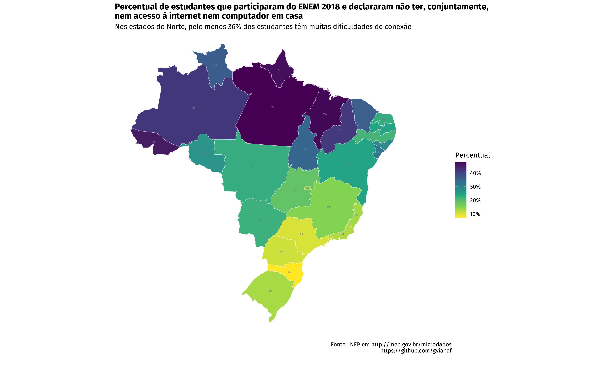
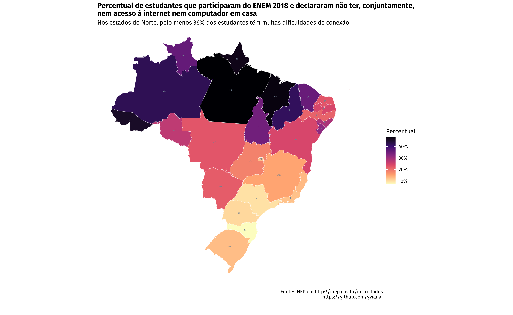

# ENEM 2018
## Data analysis of the ENEM 2018 results

For this project, I used data from the High School National Exam or ENEM (in Portuguese: ENEM), which is an admission exam used by many universities in Brazil. Data from the last edition (2018) is available at http://inep.gov.br/microdados. The file is quite large (3GB), so it will not be available in this repository.

This brief exploration aimed to give context to the following question: is internet access ubiquitous country-wise? After analyzing two topics from the socioeconomic questionnaire, the answer unfolds: it's not.

To represent that finding visually, I plotted two maps (with different choropleths), using ggplot2, and made an interactive map (HTML widget) using the leaflet package.

 

 

